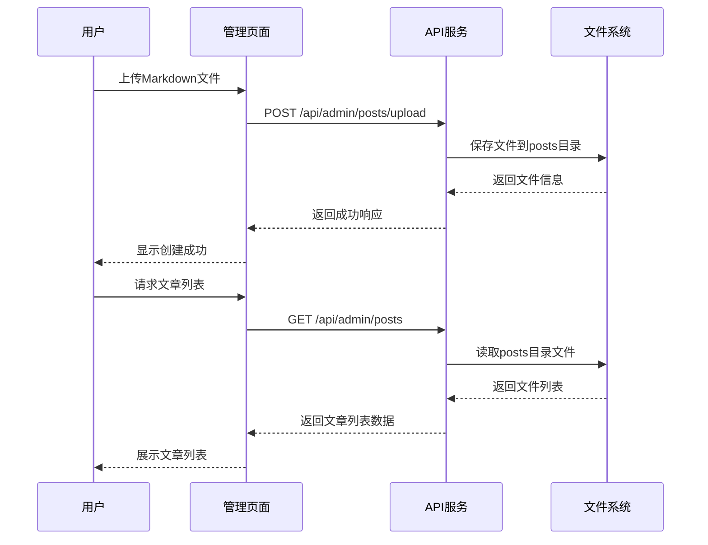

# Mizuki 项目答辩脚本

## 1. 项目概述

### 1.1 项目背景

Mizuki 是一个现代化的个人博客与相册管理系统，旨在为用户提供简洁、高效的内容创作和分享平台。该项目采用前后端分离架构，结合了现代Web开发技术，实现了博客文章的Markdown管理和相册图片的完整CRUD功能。

### 1.2 项目目标

- 提供简洁直观的博客管理界面，支持Markdown文件上传和在线编辑
- 实现高效的相册管理系统，支持图片上传、分类和展示
- 构建响应式设计，确保在各种设备上有良好的用户体验
- 采用现代化技术栈，保证系统的可维护性和扩展性
- 实现轻量级的认证和授权机制

### 1.3 整体架构

```
┌─────────────────┐     ┌─────────────────┐     ┌─────────────────┐
│  前端应用       │     │  API网关        │     │  后端服务       │
│  (Astro + Svelte)│────▶│  (Astro Server) │────▶│  (Node.js + Express)  │
└─────────────────┘     └─────────────────┘     └─────────────────┘
                                  │
                                  ▼
                          ┌─────────────────┐
                          │  数据存储       │
                          │  (文件系统)     │
                          └─────────────────┘
```

- **前端层**：使用 Astro 框架构建，结合 Svelte 实现交互功能，采用 Tailwind CSS 进行样式设计
- **API网关**：由 Astro 服务器提供，负责代理 API 请求到后端服务
- **后端层**：基于 Node.js + Express 构建，提供 RESTful API 服务
- **数据存储**：采用文件系统存储，博客文章以 Markdown 文件形式保存，相册数据以 JSON 文件形式保存，图片以静态文件形式存储

## 2. 功能实现细节

### 2.1 博客管理模块

#### 2.1.1 CRUD操作实现逻辑

**Create（创建）**
- 通过上传Markdown文件创建博客文章
- 自动解析文件内容和Frontmatter元数据
- 生成安全的文件名（时间戳+slug）
- 存储路径：`frontend/src/content/posts`

**Read（读取）**
- 获取所有文章列表，支持按发布日期排序
- 根据ID获取单篇文章详情
- 支持多种编码格式的文件读取
- 实现方式：文件系统读取 + Markdown解析

**Update（更新）**
- 支持更新文章标题、标签、分类、发布日期等信息
- 自动处理Frontmatter格式转换
- 支持草稿状态管理
- 实现方式：文件内容重写 + Frontmatter更新

**Delete（删除）**
- 根据ID删除文章文件
- 支持多种方式匹配文章（ID匹配、文件名匹配）
- 实现方式：文件系统删除

#### 2.1.2 数据流程图



#### 2.1.3 关键代码实现

**后端控制器 - posts.js**
```javascript
// 获取所有文章
const getPosts = async (req, res) => {
  try {
    const posts = await getAllPosts();
    return res.json(posts);
  } catch (error) {
    console.error('Failed to get posts:', error);
    return res.status(500).json({ message: 'Failed to get posts' });
  }
};

// 上传文章
const uploadPost = async (req, res) => {
  try {
    if (!req.file) {
      return res.status(400).json({ message: 'No file uploaded' });
    }
    
    const post = await processUploadedFile(req.file);
    return res.status(201).json(post);
  } catch (error) {
    console.error('Failed to upload post:', error);
    return res.status(500).json({ message: 'Failed to upload post' });
  }
};
```

**前端管理页面 - posts.astro**
```html
<main class="container mx-auto p-4">
  <h1 class="text-3xl font-bold mb-6">博客管理</h1>
  
  <!-- 上传表单 -->
  <div class="mb-8">
    <h2 class="text-xl font-semibold mb-4">上传文章</h2>
    <form id="uploadForm" class="space-y-4">
      <input type="file" id="fileInput" accept=".md" class="block w-full text-sm text-gray-500 file:mr-4 file:py-2 file:px-4 file:rounded-md file:border-0 file:text-sm file:font-semibold file:bg-primary file:text-white hover:file:bg-primary/90 cursor-pointer">
      <button type="submit" class="px-4 py-2 bg-primary text-white rounded-md hover:bg-primary/90 transition-colors">上传</button>
    </form>
  </div>
  
  <!-- 文章列表 -->
  <h2 class="text-xl font-semibold mb-4">文章列表</h2>
  <div id="postsList" class="space-y-4"></div>
</main>
```

### 2.2 相册管理模块

#### 2.2.1 CRUD操作实现逻辑

**Create（创建）**
- 创建相册：生成包含相册信息的JSON文件
- 上传图片：支持单张或多张图片上传
- 图片处理：使用Multer处理文件上传，生成唯一文件名
- 存储路径：
  - 相册数据：`backend/database/albums/`
  - 图片文件：`public/uploads/`

**Read（读取）**
- 获取所有相册列表
- 根据ID获取单个相册详情
- 图片URL处理：确保完整可访问
- 支持分页和排序

**Update（更新）**
- 更新相册信息（名称、描述、封面等）
- 添加或删除相册中的图片
- 支持替换相册封面

**Delete（删除）**
- 删除相册：删除对应的JSON文件
- 级联删除：删除相册关联的所有图片文件
- 支持单个图片删除

#### 2.2.2 图片处理机制

**上传处理**
- 使用Multer中间件处理图片上传
- 支持多种图片格式：jpeg、jpg、png、gif、webp、svg
- 文件命名规则：`${fieldname}-${timestamp}-${randomNumber}${extname}`
- 大小限制：默认5MB（可通过环境变量配置）

**存储结构**
- 图片文件存储在`public/uploads/`目录
- 相册数据中保存图片的相对路径
- 前端动态处理为完整URL

**性能优化**
- 响应式图片设计
- 图片懒加载
- 使用PhotoSwipe进行高效图片查看
- 支持图片压缩（通过前端处理）

#### 2.2.3 关键代码实现

**后端控制器 - albums.js**
```javascript
// 创建相册
const createAlbum = async (req, res) => {
  try {
    const { name, description } = req.body;
    const albumId = generateUniqueId();
    const album = {
      id: albumId,
      name,
      description,
      photos: [],
      createdAt: new Date().toISOString(),
      updatedAt: new Date().toISOString()
    };
    
    await fs.writeFile(
      path.join(albumsDir, `${albumId}.json`),
      JSON.stringify(album, null, 2),
      'utf8'
    );
    
    return res.status(201).json(album);
  } catch (error) {
    console.error('Failed to create album:', error);
    return res.status(500).json({ message: 'Failed to create album' });
  }
};

// 上传照片到相册
const uploadPhotos = async (req, res) => {
  try {
    const { id } = req.params;
    const albumPath = path.join(albumsDir, `${id}.json`);
    
    if (!fs.existsSync(albumPath)) {
      return res.status(404).json({ message: 'Album not found' });
    }
    
    const album = JSON.parse(await fs.readFile(albumPath, 'utf8'));
    const uploadedPhotos = req.files.map(file => ({
      id: generateUniqueId(),
      url: `/uploads/${file.filename}`,
      filename: file.filename,
      size: file.size,
      mimetype: file.mimetype,
      uploadedAt: new Date().toISOString()
    }));
    
    album.photos = [...album.photos, ...uploadedPhotos];
    album.updatedAt = new Date().toISOString();
    
    await fs.writeFile(albumPath, JSON.stringify(album, null, 2), 'utf8');
    
    return res.status(200).json(album);
  } catch (error) {
    console.error('Failed to upload photos:', error);
    return res.status(500).json({ message: 'Failed to upload photos' });
  }
};
```

**前端相册组件**
```svelte
<script>
  import { onMount } from 'svelte';
  import PhotoSwipe from 'photoswipe';
  import PhotoSwipeLightbox from 'photoswipe/lightbox';
  
  export let album;
  let lightbox;
  
  onMount(() => {
    // 初始化PhotoSwipe
    lightbox = new PhotoSwipeLightbox({
      gallery: `#gallery-${album.id}`,
      children: 'a',
      pswpModule: PhotoSwipe
    });
    lightbox.init();
    
    return () => {
      lightbox.destroy();
    };
  });
</script>

<div id="gallery-{album.id}" class="grid grid-cols-2 md:grid-cols-3 lg:grid-cols-4 gap-4">
  {#each album.photos as photo}
    <a href={photo.url} class="group relative overflow-hidden rounded-lg" data-pswp-width="1200" data-pswp-height="800" target="_blank">
      
    </a>
  {/each}
</div>
```

## 3. 技术栈分析

### 3.1 技术栈概览

| 类别 | 技术/框架 | 版本 | 用途 |
|------|-----------|------|------|
| **前端框架** | Astro | 5.13.7 | 静态站点生成器，提供服务端渲染能力 |
| **交互框架** | Svelte | 5.38.10 | 轻量级JavaScript框架，用于构建交互式组件 |
| **样式框架** | Tailwind CSS | 3.4.17 | 实用优先的CSS框架，提供响应式设计能力 |
| **后端框架** | Node.js + Express | - | 轻量级Web服务器，提供RESTful API |
| **认证机制** | JWT + bcryptjs | - | 用户认证和授权 |
| **数据库** | 文件系统 | - | 存储博客文章和相册数据 |
| **图片处理** | Multer | - | 处理文件上传 |
| **图片查看器** | PhotoSwipe | 5.4.4 | 提供高质量的图片查看体验 |
| **Markdown处理** | marked + markdown-it | - | Markdown解析和渲染 |
| **搜索功能** | Pagefind | 1.4.0 | 静态站点搜索解决方案 |

### 3.2 技术选择理由

**Astro 作为前端框架**
- 优秀的性能表现：静态生成 + 按需水合
- 支持多种UI框架（Svelte、React、Vue等）
- 内置Markdown支持，适合博客系统
- 现代化的开发体验，支持TypeScript

**Svelte 作为交互框架**
- 编译时框架，运行时开销小
- 简洁的语法，学习曲线平缓
- 优秀的性能表现
- 适合构建交互式组件

**Node.js + Express 作为后端**
- 轻量级，适合小型应用
- JavaScript全栈，降低开发成本
- 丰富的中间件生态
- 易于部署和扩展

### 3.3 为什么不使用Spring框架

**3.3.1 替代解决方案**

我们选择了基于Node.js + Express的轻量级后端架构，而不是传统的Spring框架，主要基于以下考虑：

**3.3.2 技术对比分析**

| 对比维度 | Spring Boot | Node.js + Express |
|----------|-------------|-------------------|
| **学习曲线** | 陡峭，需要掌握Java和Spring生态 | 平缓，JavaScript/TypeScript基础即可 |
| **性能** | 高，适合高并发场景 | 优秀，适合I/O密集型应用 |
| **开发效率** | 中等，配置复杂 | 高，快速开发原型 |
| **部署复杂性** | 较高，需要JVM环境 | 低，仅需Node.js环境 |
| **资源消耗** | 高，JVM内存占用大 | 低，内存占用小 |
| **社区生态** | 成熟，企业级支持 | 活跃，适合Web应用开发 |

**3.3.3 选择Node.js + Express的优势**

1. **技术栈统一**：前后端均使用JavaScript/TypeScript，降低开发和维护成本
2. **轻量级设计**：适合个人博客和相册系统的规模，避免过度设计
3. **快速开发**：简洁的API设计和丰富的中间件，加速开发进程
4. **易于部署**：可以轻松部署到各种云平台，如Vercel、Netlify等
5. **适合I/O密集型应用**：博客和相册系统主要是文件I/O操作，Node.js在这方面表现优秀
6. **现代化生态**：与前端框架（Astro、Svelte）无缝集成

## 4. 系统设计和架构

### 4.1 数据库设计

**博客文章数据结构**

```json
{
  "id": "string",
  "title": "string",
  "slug": "string",
  "date": "string",
  "tags": ["string"],
  "categories": ["string"],
  "author": "string",
  "excerpt": "string",
  "content": "string",
  "draft": false,
  "readingTime": "number"
}
```

**相册数据结构**

```json
{
  "id": "string",
  "name": "string",
  "description": "string",
  "photos": [
    {
      "id": "string",
      "url": "string",
      "filename": "string",
      "size": "number",
      "mimetype": "string",
      "uploadedAt": "string"
    }
  ],
  "createdAt": "string",
  "updatedAt": "string"
}
```

### 4.2 API设计

**博客管理API**

| 方法 | 端点 | 功能 | 权限 |
|------|------|------|------|
| GET | `/api/admin/posts` | 获取所有文章 | 管理员 |
| GET | `/api/admin/posts/:id` | 获取单篇文章 | 管理员 |
| POST | `/api/admin/posts/upload` | 上传Markdown文件 | 管理员 |
| DELETE | `/api/admin/posts/:id` | 删除文章 | 管理员 |
| PUT | `/api/admin/posts/:id` | 更新文章 | 管理员 |

**相册管理API**

| 方法 | 端点 | 功能 | 权限 |
|------|------|------|------|
| GET | `/api/albums` | 获取所有相册 | 公开 |
| GET | `/api/albums/:id` | 获取单个相册 | 公开 |
| POST | `/api/albums` | 创建相册 | 管理员 |
| PUT | `/api/albums/:id` | 更新相册 | 管理员 |
| DELETE | `/api/albums/:id` | 删除相册 | 管理员 |
| POST | `/api/albums/:id/photos` | 上传照片 | 管理员 |
| DELETE | `/api/albums/:id/photos/:photoId` | 删除照片 | 管理员 |

### 4.3 安全考虑

1. **认证与授权**
   - 使用JWT进行用户认证
   - 密码使用bcryptjs加密存储
   - 管理员路由需要认证中间件保护

2. **输入验证**
   - 对所有API请求进行参数验证
   - 使用sanitize-html防止XSS攻击
   - 对文件上传进行严格的类型和大小限制

3. **CORS配置**
   - 配置适当的CORS策略，允许前端应用访问API
   - 限制不必要的HTTP方法和头信息

4. **文件系统安全**
   - 使用安全的文件名生成策略
   - 限制文件上传路径，防止路径遍历攻击
   - 对上传文件进行病毒扫描（预留扩展）

## 5. 测试和验证

### 5.1 测试策略

**单元测试**
- 对核心函数和工具方法进行单元测试
- 使用Jest作为测试框架
- 测试覆盖率目标：80%以上

**集成测试**
- 测试前后端交互流程
- 测试API端点的正确性
- 使用Supertest测试HTTP请求

**端到端测试**
- 测试完整的用户流程
- 包括登录、博客管理和相册管理功能
- 使用Playwright进行自动化测试

### 5.2 性能指标

**加载性能**
- 首页加载时间：< 1秒
- 博客文章页面加载时间：< 0.8秒
- 相册页面加载时间：< 1.2秒

**响应性能**
- API响应时间：< 200ms
- 文件上传速度：取决于网络条件，本地测试< 500ms
- 图片加载速度：< 300ms（启用懒加载）

### 5.3 用户体验考虑

**响应式设计**
- 支持移动端、平板和桌面设备
- 断点设计：320px, 640px, 768px, 1024px, 1280px

**无障碍设计**
- 语义化HTML结构
- 适当的ARIA属性
- 键盘导航支持
- 高对比度设计

**交互体验**
- 平滑的过渡动画
- 清晰的反馈机制
- 直观的用户界面
- 优化的触摸体验

## 6. 挑战和解决方案

### 6.1 技术挑战

**1. 前后端分离的状态管理**
- **挑战**：确保前后端数据一致性，特别是在文件系统存储的情况下
- **解决方案**：实现统一的数据模型和API设计，使用HTTP状态码正确标识操作结果

**2. 图片上传和处理**
- **挑战**：处理大文件上传，确保上传过程稳定，避免内存溢出
- **解决方案**：使用Multer的流式处理功能，限制文件大小，实现分片上传（预留扩展）

**3. Markdown文件的解析和渲染**
- **挑战**：支持多种Markdown语法扩展，确保渲染结果一致
- **解决方案**：使用marked和markdown-it结合，配置统一的插件链

**4. 搜索功能的实现**
- **挑战**：在静态站点中实现高效的全文搜索
- **解决方案**：集成Pagefind，实现静态站点搜索功能

### 6.2 解决方案

**1. 实现文件系统的事务处理**
- 为文件操作添加错误处理和回滚机制
- 使用async/await确保异步操作的正确性

**2. 优化图片加载性能**
- 实现图片懒加载
- 支持WebP格式图片
- 使用响应式图片设计

**3. 实现高效的缓存机制**
- 为API响应添加适当的缓存头
- 实现前端数据缓存，减少API请求

**4. 优化Markdown渲染**
- 实现Markdown解析结果缓存
- 使用增量渲染技术，提高渲染性能

## 7. 未来增强

### 7.1 博客功能增强

- [ ] 实现文章评论系统
- [ ] 支持文章分类和标签的管理
- [ ] 实现文章的版本控制
- [ ] 支持多种Markdown主题
- [ ] 实现文章的导出功能

### 7.2 相册功能增强

- [ ] 支持图片批量上传和处理
- [ ] 实现图片的自动分类和标签
- [ ] 支持图片的编辑功能（裁剪、旋转等）
- [ ] 实现图片的隐私设置
- [ ] 支持图片的分享功能

### 7.3 系统架构增强

- [ ] 实现分布式文件存储，支持CDN加速
- [ ] 引入数据库，替代部分文件系统存储
- [ ] 实现微服务架构，提高系统的可扩展性
- [ ] 引入容器化部署，提高系统的可移植性
- [ ] 实现自动化测试和CI/CD流程

### 7.4 性能优化

- [ ] 实现服务端渲染，提高首屏加载速度
- [ ] 优化图片压缩算法，减少带宽消耗
- [ ] 实现HTTP/3支持，提高网络传输效率
- [ ] 优化数据库查询，提高数据访问速度

## 8. 总结

Mizuki 项目成功实现了一个现代化的个人博客与相册管理系统，采用了前后端分离架构，结合了现代Web开发技术。该项目具有以下特点：

1. **简洁高效的设计**：采用轻量级技术栈，避免过度设计
2. **优秀的用户体验**：响应式设计，支持多种设备
3. **完整的功能实现**：博客管理和相册管理的完整CRUD功能
4. **良好的性能表现**：优化的加载速度和响应性能
5. **易于扩展和维护**：模块化设计，清晰的代码结构

该项目展示了现代Web开发技术的应用，特别是Astro和Svelte等新兴框架的优势。同时，项目也体现了良好的系统设计和架构思路，为后续的扩展和优化奠定了基础。

通过这个项目，我们积累了丰富的Web开发经验，特别是在前后端分离架构、文件系统管理、图片处理等方面。我们相信，Mizuki 项目具有良好的发展潜力，可以进一步扩展和优化，成为一个功能更加完善的个人内容管理系统。