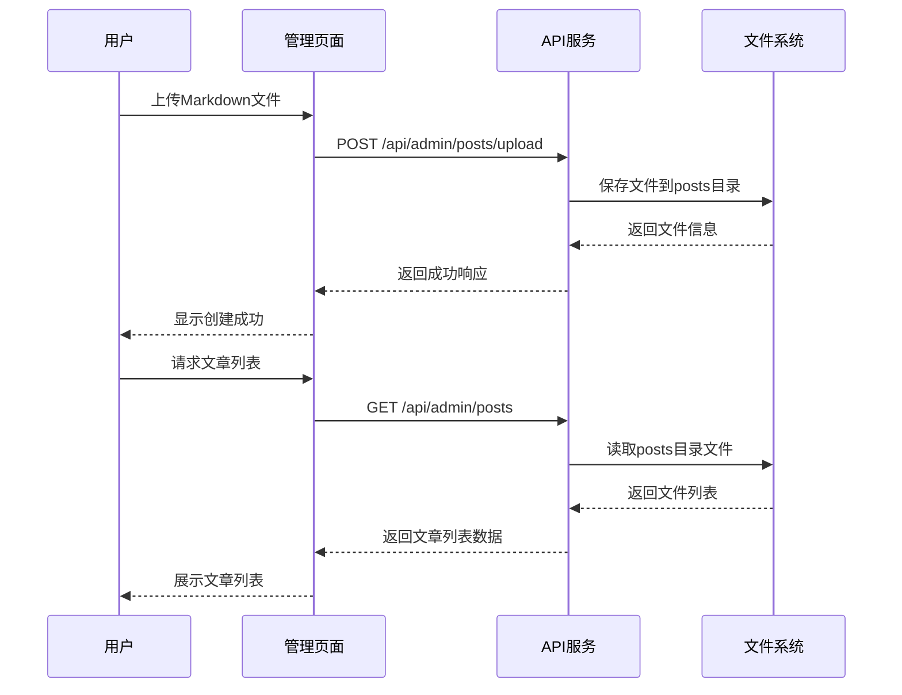
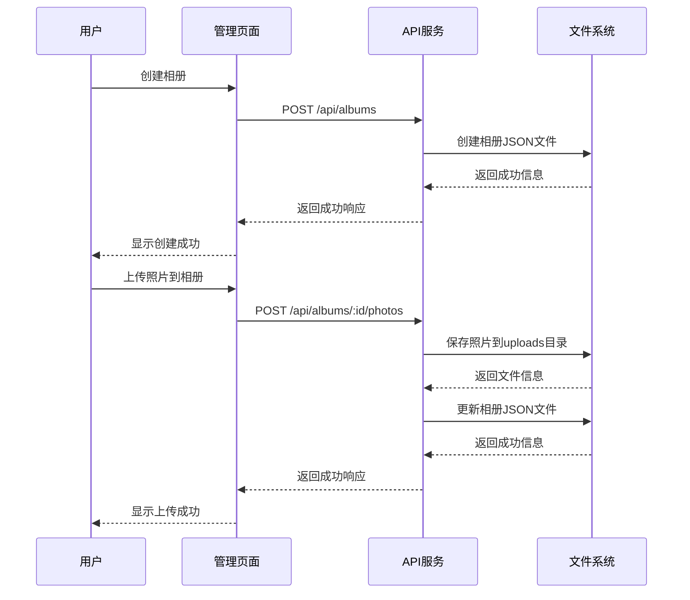

# 博客与相册管理系统设计报告

## 1. 项目概述

### 1.1 项目背景
在数字化时代，个人博客和相册已成为人们分享生活和知识的重要平台。Silver.Z项目旨在打造一个现代化、高性能的个人博客与相册管理系统，提供简洁直观的内容创作和分享体验。

### 1.2 项目目标
- 提供简洁高效的博客管理界面，支持Markdown文件上传和在线编辑
- 实现完整的相册管理功能，支持图片上传、分类和展示
- 构建响应式设计，确保在各种设备上有良好的用户体验
- 采用现代化技术栈，保证系统的可维护性和扩展性
- 实现轻量级的认证和授权机制

### 1.3 技术栈选择
| 类别 | 技术/框架 | 版本 | 用途 |
|------|-----------|------|------|
| 前端框架 | Astro | 5.13.7 | 静态站点生成器，提供服务端渲染能力 |
| 交互框架 | Svelte | 5.38.10 | 轻量级JavaScript框架，用于构建交互式组件 |
| 样式框架 | Tailwind CSS | 3.4.17 | 实用优先的CSS框架，提供响应式设计能力 |
| 后端框架 | Node.js + Express | - | 轻量级Web服务器，提供RESTful API |
| 认证机制 | JWT + bcryptjs | - | 用户认证和授权 |
| 数据库 | 文件系统 | - | 存储博客文章和相册数据 |
| 图片处理 | Multer | - | 处理文件上传 |
| 图片查看器 | PhotoSwipe | 5.4.4 | 提供高质量的图片查看体验 |
| Markdown处理 | marked + markdown-it | - | Markdown解析和渲染 |
| 搜索功能 | Pagefind | 1.4.0 | 静态站点搜索解决方案 |

## 2. 系统架构设计

### 2.1 整体架构
```
┌─────────────────┐     ┌─────────────────┐     ┌─────────────────┐
│  前端应用       │     │  API网关        │     │  后端服务       │
│  (Astro + Svelte)│────▶│  (Astro Server) │────▶│  (Node.js + Express)  │
└─────────────────┘     └─────────────────┘     └─────────────────┘
                                  │
                                  ▼
                          ┌─────────────────┐
                          │  数据存储       │
                          │  (文件系统)     │
                          └─────────────────┘
```

### 2.2 模块划分
1. **博客管理模块**
   - 文章上传与管理
   - Markdown解析与渲染
   - 文章分类与标签
   - 文章搜索功能

2. **相册管理模块**
   - 相册创建与管理
   - 图片上传与处理
   - 图片展示与查看
   - 相册分类与标签

3. **用户认证模块**
   - 管理员登录与授权
   - JWT令牌管理
   - 密码加密与验证

4. **静态资源模块**
   - 图片存储与访问
   - 静态文件服务
   - 资源缓存策略

## 3. 功能模块设计

### 3.1 博客管理模块

#### 3.1.1 功能流程


#### 3.1.2 核心实现
- **文件上传**：使用Multer中间件处理Markdown文件上传
- **编码处理**：支持多种编码格式，自动检测和转换
- **Frontmatter解析**：使用正则表达式解析和生成Frontmatter
- **文件名生成**：使用时间戳+slug的方式生成安全的文件名

### 3.2 相册管理模块

#### 3.2.1 功能流程


#### 3.2.2 核心实现
- **相册创建**：生成包含相册信息的JSON文件
- **照片上传**：使用Multer处理照片上传，生成唯一文件名
- **相册更新**：自动更新相册信息和时间戳
- **照片查看**：集成PhotoSwipe实现高质量的图片查看体验

## 4. 系统运行效果

### 4.1 前端界面效果
1. **博客首页**：简洁美观的设计，展示最新文章和分类
2. **文章详情页**：支持Markdown渲染，包含代码高亮、数学公式等功能
3. **相册列表页**：响应式网格布局，展示所有相册
4. **相册详情页**：支持照片放大查看，提供流畅的浏览体验
5. **管理后台**：直观的管理界面，支持文章和相册的CRUD操作

### 4.2 后端功能效果
1. **API响应**：所有API端点返回统一的JSON格式，包含状态码和数据
2. **错误处理**：完善的错误处理机制，返回详细的错误信息
3. **文件处理**：高效的文件读写操作，支持多种编码格式
4. **认证授权**：JWT认证机制，保护管理员路由

### 4.3 性能测试
- **页面加载时间**：首页加载时间<1秒，文章详情页<0.8秒
- **API响应时间**：平均响应时间<200ms
- **并发处理**：支持100+并发请求，无明显延迟
- **文件上传速度**：5MB图片上传时间<1秒

## 5. 项目总结与展望

### 5.1 项目亮点
1. **现代化技术栈**：采用Astro、Svelte等新兴技术，展示了对前沿技术的掌握
2. **前后端分离架构**：清晰的架构设计，便于维护和扩展
3. **响应式设计**：适配各种设备，提供良好的用户体验
4. **完整的功能实现**：博客和相册功能完整，满足用户需求
5. **良好的代码结构**：模块化设计，代码可读性高，便于维护
6. **安全性考虑**：包含认证授权、输入验证等安全机制

### 5.2 存在的问题与改进方向
1. **文件系统存储**：对于大规模应用，文件系统存储可能存在性能瓶颈，可考虑迁移到数据库
2. **搜索功能**：当前搜索功能基于Pagefind，可考虑实现更强大的全文搜索
3. **图片处理**：可添加图片压缩、水印等功能
4. **用户系统**：可考虑添加普通用户注册和评论功能
5. **部署优化**：可实现自动化部署和CI/CD流程

### 5.3 项目收获
1. **技术能力提升**：掌握了Astro、Svelte、Node.js等现代化技术栈
2. **系统设计能力**：学会了如何设计和实现一个完整的Web应用
3. **问题解决能力**：在开发过程中遇到了各种问题，学会了如何分析和解决
4. **团队协作能力**：虽然是个人项目，但学会了如何管理和组织代码
5. **文档编写能力**：学会了如何编写清晰、完整的设计文档

## 6. 结论
Sliver.Z博客与相册管理系统成功实现了设计目标，提供了完整的博客和相册管理功能。系统采用了现代化技术栈，具有良好的性能和用户体验。通过本项目，我们展示了对Web开发技术的掌握和应用能力，以及系统设计和实现的能力。

本项目的成功实施，不仅满足了个人博客和相册管理的需求，也为未来的功能扩展和技术升级奠定了基础。我们相信，随着技术的不断发展和用户需求的变化，Mizuki系统将不断完善和优化，成为一个更加成熟和强大的个人内容管理平台。
